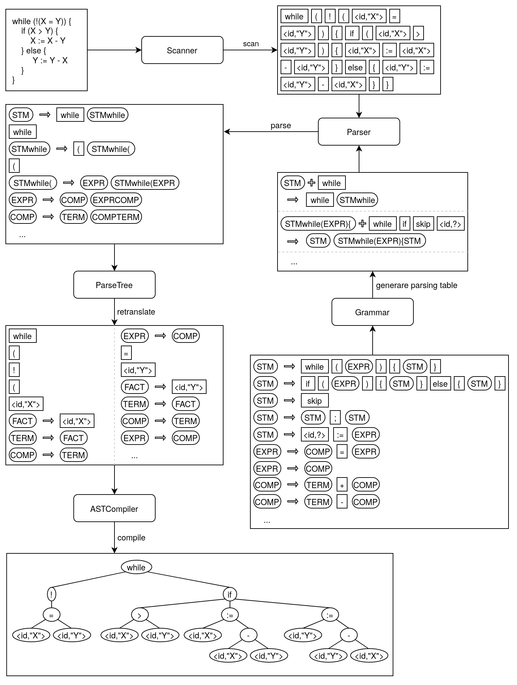

# while
The while-language is a toy programming language that consists only of the most basic control flow structures. It's advantage is that programs can be verified easily.

### What is this about?

In this project I implemented a compiler for this language. Compiler might not be the most descriptive word because the program only transforms code of the toy language into an abstract tree-like structure that might be compiled further. One might say: The back-end is missing. However, it is already possible to execute such programs.

I initiated this project when I attended the lectures "Theory of Programming" and "Compiler Construction". This project brings those two lectures together in a very nice way.

### An overview of the compiler

The program translates code into formal objects through several steps. These are depicted in the following diagram.

The classes Scanner, Parser, ParseTree and ASTComplier are part of a pipeline that operate in parallel and pass data through streams. The Parser uses a ParsingTable that has to be generated using a formal grammar. The Grammar class provides a method to transform many context-free grammars into an LL(1)-grammar. The ParseTree class reverts this transformation so that the information provided by the Parser is given w.r.t. the initial grammar. This automated process makes it very easy to implement new language features as they can be formulated on the level of context free grammars instead of LL(1)-grammars.

### There is more: Automated verification

After the compilation the formal construct build from the code can be analysed using the Hoare Calculus. This is a common formalism used to verify partial correctness of programs. This project provides a semi-automated proof generator. From the compiled code and given pre- and post-conditions it generates a so-called Hoare tree. The only thing it does not do is introducing valid loop invariants and proving the correctness of the implications appearing in the Hoare tree arising from the consequence rule.

### Where to begin?

If you want to understand this project in more detail or aim to create a compiler for your own programming language, then take a look at the [getting started section](getting started/README.md).
