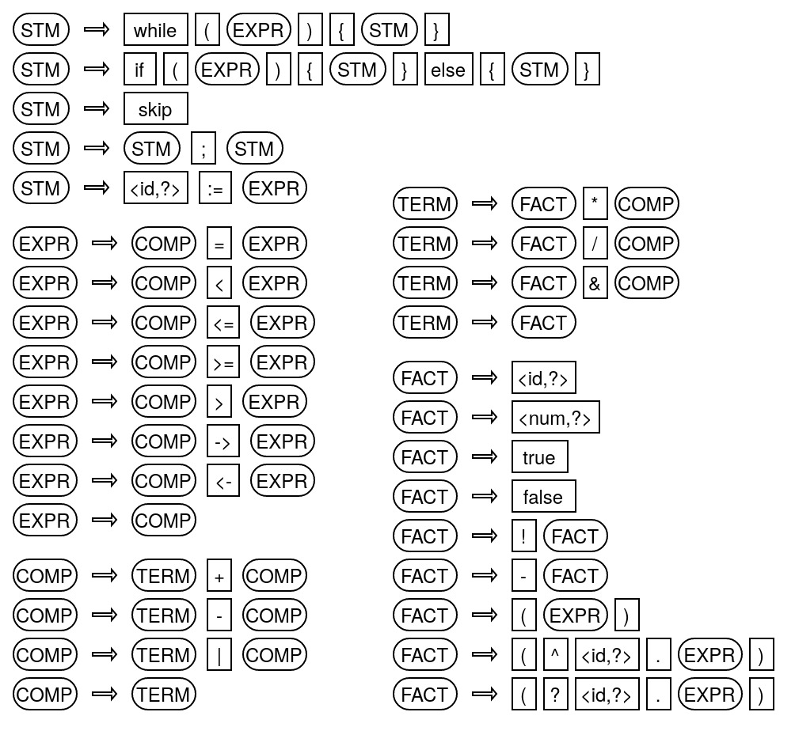

# The basic grammar

The class BasicRuleSet provides a simple, yet non-trivial, grammar. This grammar already defines a Turing-complete programing language and takes care of the order of operations. In a bit more readable form the grammar is depicted as follows:

STM stands for statement. The five rules describe the basic shape of code. EXPR stands for expression, COMP stands for comparison, TERM stands for term and FACT stands for factor. These for levels determine the order of the described operations. Operations on the FACT-level bind strongest while the comparison operations on the EXPR-level bind weakest. The last two rules define the shape of quantified expressions, i.e. for-all-expressions and exists-expressions.
