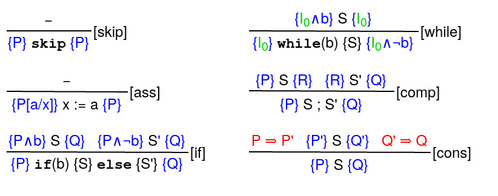
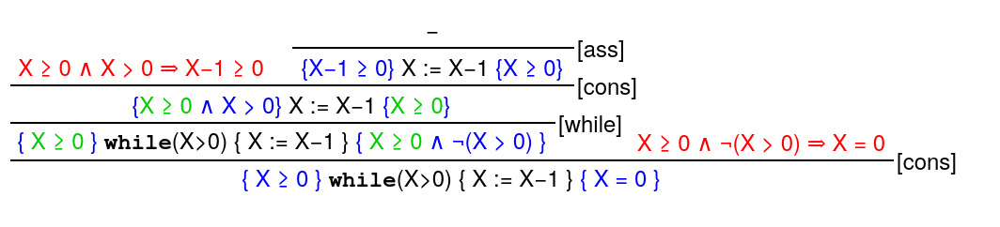

# The Hoare Calculus

The Hoare Calculus provides a method to prove partial correctness of programs. The [`BasicHoare`](../vvhile/hoare/BasicHoare.java) class yields two [`Axioms`](../vvhile/hoare/Axiom.java) and four [`Rules`](../vvhile/hoare/Rule.java) with which one can create proof outlines. Let's take a look at them.

<center>

</center>

The blue expressions are pre- and post-conditions. A [triple](../vvhile/hoare/HoareTriple.java) of the form **{P} S {Q}** states the following:

_If the condition **P** is satisfied, then **Q** is satisfied after the program **S** was being executed._

The green expression represents a loop invariant. Loop invariants make automated program verifications difficult. We look at an example in just a minute. Lastly, the red expressions are so-called obligations. During the verification process all obligations have to be checked for correctness. Using these axioms and rules, all programs can be transformed into a [`HoareTree`](../vvhile/hoare/HoareTree.java) to extract a list of obligations. Depending on the length of the program such a tree can become very complex. Let us therefore look at a very short program.

```java
while(X > 0) { X := X-1 }
```

Intuitively the program decreases the value of `X` as long as it is positive, therefore after executing the program the expression `X=0` should be true. However, a precondition has to be satisfied: The value of `X` must be non-negative. Let's look at the Hoare tree.

<center>

</center>

For the creation of this tree we had to choose a loop invariant. Everything else comes more or less by itself. Indeed an instance of the class [`HoareProver`](../vvhile/hoare/HoareProver.java) can be used to automatically generate Hoare trees. The resulting Hoare trees contain a [`BlackBox`](../vvhile/hoare/BooleanFormula.java) for every loop invariant.

After the Hoare tree was built, we can investigate the obligations and check their correctness. In this case this should be trivial (for a human at least!).

[Back to Overview](README.md)
