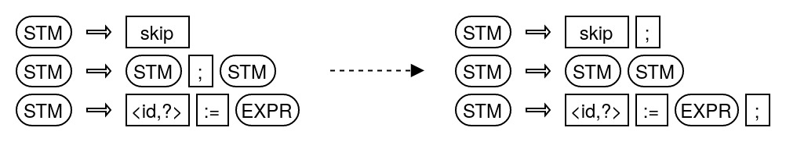

# Modifying the grammar

The grammar as given by the [`BasicRuleSet`](../vvhile/basic/language/BasicRuleSet.java) class is very simple when it comes to the five basic [`Rules`](../vvhile/frontend/Rule.java) for creating statements. Yet, one thing is a bit unfamiliar when writen actual code in this language: There is a semicolon between any two consecutive statements. Usually there is a semicolon after every line of instruction. In this these are exactly the assignments and skip.

To change the grammar resemble the more familiar style we have to perform the following modification.

<center>

</center>

To achieve this in code, we have to do manipulate the following lines in the [`BasicRuleSet`](../vvhile/basic/language/BasicRuleSet.java) class:
```java
    private static final Rule STM_ASSIGN = new Rule(STM, /* -> */ ID, ASSIGN, EXPR);
    private static final Rule STM_SKIP = new Rule(STM, /* -> */ SKIP);
    private static final Rule STM_COMPOSITION = new Rule(STM, /* -> */ STM, SEMICOLON, STM);
```
Change them to:
```java
    private static final Rule STM_ASSIGN = new Rule(STM, /* -> */ ID, ASSIGN, EXPR, SEMICOLON);
    private static final Rule STM_SKIP = new Rule(STM, /* -> */ SKIP, SEMICOLON);
    private static final Rule STM_COMPOSITION = new Rule(STM, /* -> */ STM, STM);
```

These changes apply to the grammar. In order for the compiler to work properly, we have to adjust the so-called [`StatementBuilders`](../vvhile/intrep/StatementBuilder.java) as well. In the constructor change the lines
```java
        addRule(STM_ASSIGN, new StatementBuilder(
                args -> new Statement.Assignment((Expression.Variable) args[0], (Expression) args[2]),
                Token.Identifier.class, ASSIGN, Expression.class));
        addRule(STM_SKIP, new StatementBuilder(args -> new Statement.Skip(), SKIP));
        addRule(STM_COMPOSITION, new StatementBuilder(
                args -> new Statement.Composition((Statement) args[0], (Statement) args[2]),
                Statement.class, SEMICOLON, Statement.class));
```
to
```java
        addRule(STM_ASSIGN, new StatementBuilder(
                args -> new Statement.Assignment((Expression.Variable) args[0], (Expression) args[2]),
                Token.Identifier.class, ASSIGN, Expression.class, SEMICOLON));
        addRule(STM_SKIP, new StatementBuilder(args -> new Statement.Skip(), SKIP, SEMICOLON));
        addRule(STM_COMPOSITION, new StatementBuilder(
                args -> new Statement.Composition((Statement) args[0], (Statement) args[1]),
                Statement.class, Statement.class));
```

Make sure to change `args[2]` to `args[1]` for the composition creation. This has to be done because there is no more semicolon between the consecutive statements which would usually be `args[1]`.

After these changes have been done, the compiler works for the modified grammar. Internally the parsing process might be done very differently, but this is invisible to us from this perspective. In particular the resulting intermediate representation of the compiled code does not change at all.

[Back to Overview](README.md)